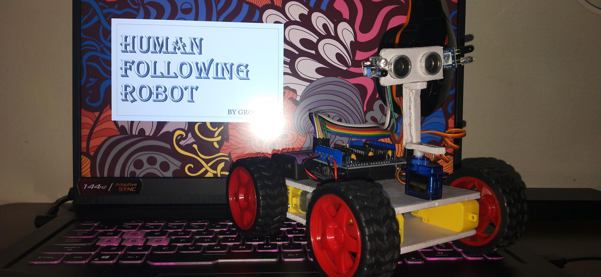

# 🤖 Human Following Robot

A gesture-controlled autonomous robot that detects and follows human movement using
IR and ultrasonic sensors, designed for assistive and real-world applications.

Arduino | Embedded Systems | Robotics | Sensors | C/C++

## 📌 Problem Statement
Manual assistance tasks such as luggage carrying, guided movement, and human monitoring
require continuous human effort. This project aims to design a portable robotic system
capable of autonomously following human gestures and distance cues.

## ⚙️ System Overview
- Detects human presence using IR and ultrasonic sensors
- Interprets distance-based gestures
- Executes forward, backward, and standby movements
- Controlled using Arduino UNO and DC motors

## 🔄 Working Principle

1. Sensors detect human presence and movement
2. Distance data is sent to Arduino UNO
3. Predefined distance thresholds are evaluated
4. Motor driver actuates wheels accordingly
5. Robot enters standby mode if no motion is detected

## ✨ Key Features

- Gesture-based forward and backward motion
- Accurate tracking in 30–70 cm range
- Modular hardware design
- Low-cost and portable prototype

## 🖼️ Project Visuals

### Fully Assembled Robot

## Arduino Control Logic

- Sensor calibration
- Distance threshold mapping
- Motor direction control
- Standby state handling

## 🚀 Applications
- Assistive robots for visually impaired users
- Smart luggage carriers
- Public assistance robots (malls, airports)
- Base model for autonomous tracking systems

